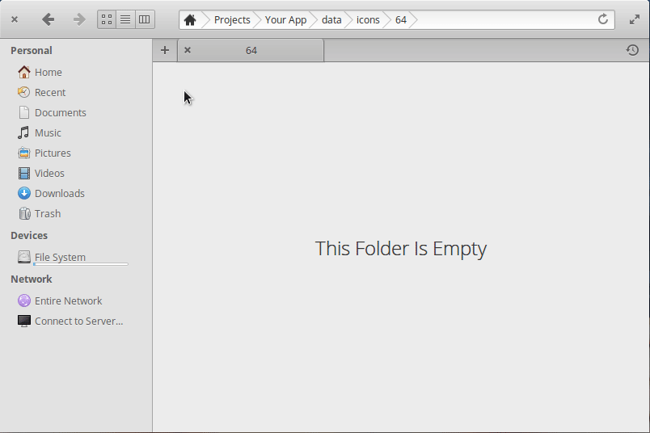

# elementary Icon Templates

A set of template icons for more quickly making third-party application icons with standard shapes that fit with the [elementary HIG](https://elementary.io/docs/human-interface-guidelines#iconography).

*These templates and thier instructions where made and intended for use on [elementary OS](https://elementary.io/). Although they might (and in theory, should) work elsewhere I have not tested and don't recommend it.*

## Installation

Cut/Copy/Paste the `Icons` folder into `~/Templates`, where `~` is your home folder (ex. `/home/yourusername/`). That's it! You should be all set :thumbsup:

#### Uninstallation

If you want to get rid of them just delete the `Icons` folder out of `~/Templates` and you're done.

## Guidelines

There is a right and wrong way to do just about everything. I want this project to help make things easier and facilitate good practices **NOT** bad ones. So, here are a few simple guidelines:

* **ALWAYS** read and follow the [elementary HIG](https://elementary.io/docs/human-interface-guidelines#iconography). These templates give you the standard shapes, strokes, gradient stops, and shadows, but using these does not mean you can ignore everything else.

* These are skeleton icons for you to build your icon upon and not a finished thing or something you can just throw text or a glyph on.

* You need every size. You can't just choose the 64px or 128px icons and make them scale down. In that same vein you need to make each size seperately; you can't just make one and squash or stretch it to fit the others. [Again](https://elementary.io/docs/human-interface-guidelines#size).

* Don't use these icons when you should (and could) use a uniquely shaped icon.

    | Don't do this                                              | Instead of this                                                |
    | :---:                                                      | :---:                                                          |
    |          |              |

* Don't just slap text or a glyph on these icons and call it done. Glyphs are fine but they need more love than a copy/paste.

    | Don't do this                                        | Do this                                                  | Or this                                                  |
    | :---:                                                | :---:                                                            | :---:                                                    |
    |          |            |    |

* Once again when in doubt consult the [HIG](https://elementary.io/docs/human-interface-guidelines#iconography).

## Usage

Assuming everything went well in the installation, using these templates is stupid simple. All you have to do is right-click in your file manager and under the "New" dropdown there should be the list of icon templates' shapes and sizes. Just choose the one you need and your off to the races. I'm not great with words so here's a shiny GIF to show you instead:

