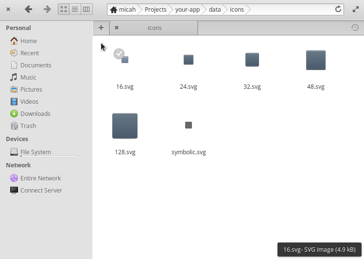

# elementary Icon Templates

A set of template icons for more quickly making third-party application icons with standard shapes that fit with the [elementary HIG](https://elementary.io/docs/human-interface-guidelines#iconography).

*These templates and thier instructions where made and intended for use on [elementary OS](https://elementary.io/). Although they might (and in theory, should) work elsewhere I have not tested and don't recommend it.*

## Installation

Cut/Copy/Paste the `icon-templates` folder into `~/Templates`, where `~` is your home folder (ex. `/home/yourusername/`). That's it! You should be all set :thumbsup:

#### Uninstallation

If you want to get rid of them just delete the `icon-templates` folder out of `~/Templates` and you're done.

## Use The [elementary HIG](https://elementary.io/docs/human-interface-guidelines#iconography)

**ALWAYS** read and follow the [elementary HIG](https://elementary.io/docs/human-interface-guidelines#iconography). These templates give you the standard shapes, strokes, gradient stops, and shadows, but using these does not mean you can ignore everything else. These are skeleton icons for you to build your icons upon and not a finished thing or something you can just throw text or a glyph on.

## Usage

Assuming everything went well in the installation, using these templates is simple. All you have to do is right-click in your file manager and under the "New" dropdown there should be the list of icon templates' shapes and sizes. Just choose the one you need and your off to the races. I'm not great with words so here's a shiny GIF to show you instead:

